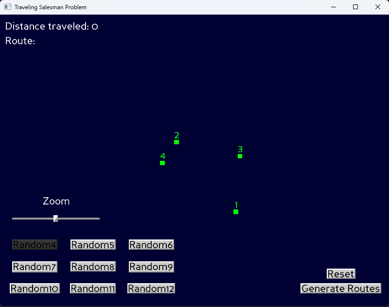

# Traveling Salesman Problem (TSP) Visualization (Panda3D)

An interactive visualization of the Traveling Salesman Problem built with Panda3D. Load TSPLIB-style .tsp files, view cities as 3D markers, click to build a route, zoom/pan the scene, and optionally brute-force all permutations for small problem sizes to see the shortest routes and their distances.

## Features
- Visualizes TSP nodes from .tsp files (TSPLIB-like format with NODE_COORD_SECTION).
- Click cities to build your own route and see the cumulative Euclidean distance.
- Buttons to switch between bundled random instances (4 to 12 cities).
- Zoom slider for camera distance.
- Brute-force route generation for small instances; results are saved to the results/ folder.
- Clean, minimal Panda3D GUI (DirectGUI) with on-screen distance and route displays.

## Project Structure
- main.py — App entry point, window setup, and problem selection buttons.
- src/ 
  - TSP.py — Simple TSPLIB-like parser and data model.
  - Map.py — Scene graph, city placement, selection, route generation, and UI elements.
  - City.py — City node model and label.
  - Bus.py — Tracks total distance for the current route and displays it.
  - tsp/ — Sample .tsp inputs (Random4.tsp … Random12.tsp).
- results/ — Output directory for brute-force results (txt files).
- config.prc — Panda3D config (e.g., window title).
- requirements.txt — Python dependencies.

## Requirements
- Python 3.13+
- Panda3D 1.11+

Install dependencies:
  - python -m pip install --upgrade pip
  - pip install -r requirements.txt

## Running the App
From the project root (same folder as main.py):

- python main.py

Notes:
- The app loads config.prc automatically for the window title.
- By default, it opens the sample problem src/tsp/Random4.tsp.

## Using the Visualization
- Escape — Quit the application.
- Left mouse click — Select a city under the cursor to append it to the current route.
  - Selected cities turn red; unselected remain green.
  - The first city (colored blue) can be clicked again to close the loop, turning all cities gold.
    - To start a new route, click Reset or click a city.
  - The “Route:” label updates as you click.
- Zoom slider (left side, labeled “Zoom”) — Adjusts camera distance.
- Buttons in lower-left (Random4 … Random12) — Switch between bundled problems. The current selected button is darkened.
- Buttons on the right:
  - Generate Routes — Brute-force all permutations for the current instance and save results to results/\<NAME\>.txt, where NAME comes from the .tsp file (NAME: field).
  - Reset — Clears the current route and distance.

Route distance:
- Uses Euclidean distance on the node coordinates in the .tsp file.
- Distance accumulates as you select cities in order; no implicit return-to-start unless you explicitly click it.

## Results Output
- When you click Generate Routes, the app enumerates all permutations of city visitation order and writes a sorted list by distance to results/\<NAME\>.txt, as well as the time taken to compute and write the results to results/\<NAME\>_time.txt.:
  - results/concorde4.txt
  - results/concorde4_time.txt
- The non-suffixed file includes each route’s total distance
- The time file contains the execution time for writing/sorting results.

## TSP File Format
This app expects a minimal TSPLIB-like format with at least:

- NAME: <identifier>
- TYPE: TSP
- DIMENSION: <n>
- NODE_COORD_SECTION
- One line per node: <index> <x> <y>

*README.md generated by Junie, the AI coding agent by JetBrains.*
